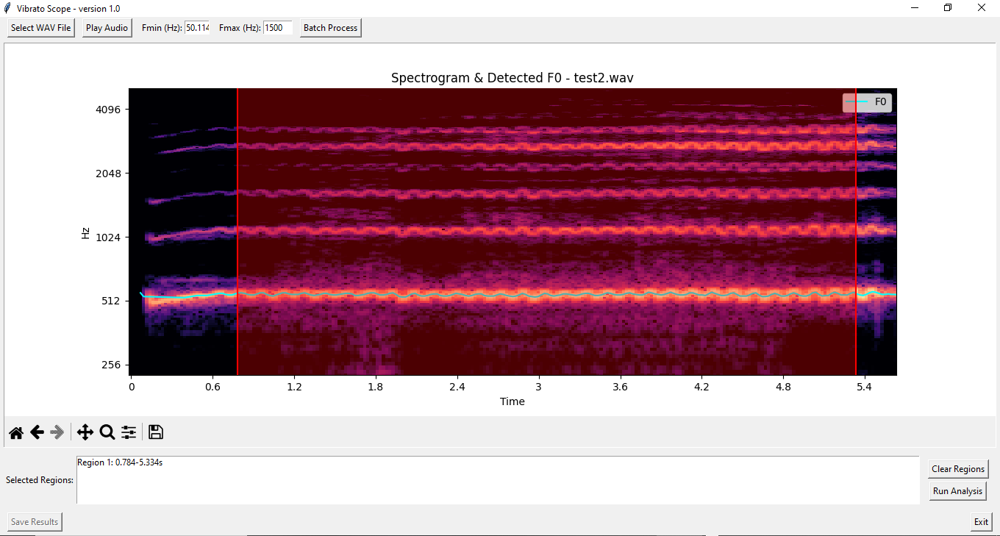

# 🎵 VibratoScope

**VibratoScope** is a Python toolkit for high-resolution analysis of vibrato in the singing voice.

It extracts vibrato rate, extent (in cents), jitter, shimmer, sample entropy, and other regularity metrics from sustained vowels or melodic phrases. A user-friendly GUI is included for region selection and visual feedback, and batch processing is supported for multiple recordings.



---

## 🧠 Features

- GUI for region selection and interactive spectrogram navigation.
- Batch processing of `.wav` files with automatic export of results.
- Multiple pitch extraction methods:
  - YIN (`librosa.pyin`)
  - Praat autocorrelation
  - Harmonic Product Spectrum (HPS)
  - REAPER (Robust Epoch and Pitch Estimator)
  - **SFEEDS** (Spectral F0 Estimation using Energy Distribution Smoothing) – adapted from the original Praat implementation
- Bandpass filtering (default 3–9 Hz) for vibrato isolation
- Extraction of:
  - Vibrato rate (Hz)
  - Vibrato extent (cents)
  - Jitter (cycle-to-cycle frequency variability)
  - Shimmer (amplitude variability)
  - Sample Entropy
  - Coefficient of Variation
- Automatic visualization:
  - Pitch traces
  - Vibrato cycles
  - Entropy and extent barplots
- CSV export for region-based and full-file summaries
- Cross-platform (Windows, macOS, Linux)

---

## 🛠️ Installation

Requires **Python 3.9+**

```bash
git clone https://github.com/tiagolbc/vibratoscope.git
cd vibratoscope
pip install -r requirements.txt
```

Some features also depend on system-level components:

- **tkinter** for the GUI
- **PortAudio** for `pyaudio`
- audio backends required by `sounddevice`

- If `pyaudio` fails to install, make sure PortAudio is available on your system.
- REAPER support is optional. The main installation does not require `pyreaper`, but users who want to use the REAPER pitch extraction method must install `pyreaper` separately.
---

## 🚀 Running VibratoScope

To launch the GUI:

```bash
python run.py
```

All functional modules are located under the `src/` directory.

---

## 📂 Example Dataset

The `examples/` folder includes synthetic vowel samples with known vibrato parameters (e.g., 6.0 Hz rate, 0.5 semitone extent).

Each test case includes:

- `.wav` file
- `.csv` results
- Pitch and vibrato analysis figures

These examples are used in validation and reproducibility. See `docs/paper.md` for citation.

---

## 🤝 Community Guidelines

VibratoScope welcomes contributions, bug reports, feature requests, and questions from the community.

### Contributing to the software

Contributions are welcome through GitHub pull requests.

Before starting a substantial change, please open an issue to describe the proposed modification and discuss whether it fits the scope of the project. This helps avoid duplicated work and ensures that new features remain consistent with VibratoScope’s goals.

To contribute:

1. Fork the repository.
2. Create a new branch for your change.
3. Make your changes with clear and readable code.
4. Include documentation updates when relevant.
5. If your change affects the analysis workflow, include a minimal example or describe how the change can be tested.
6. Submit a pull request explaining the motivation and the main changes.

Contributions may include bug fixes, documentation improvements, validation examples, new analysis features, improvements to the GUI, or refinements to existing pitch-tracking and vibrato-analysis routines.

### Reporting issues or problems

Bugs, unexpected results, installation problems, or documentation errors should be reported using GitHub Issues.

When opening an issue, please include as much of the following information as possible:

- Operating system
- Python version
- VibratoScope version or commit hash
- Installation method
- Pitch extraction method used, if relevant
- A clear description of the problem
- Steps needed to reproduce the issue
- Expected behavior
- Actual behavior
- Error messages or screenshots, when available
- A small example file, if possible and ethically shareable

Please do not upload audio files containing identifiable or sensitive voice data unless you have permission to share them publicly.

### Seeking support

For questions about installation, use, interpretation of outputs, or reproducibility, please open a GitHub Issue using a clear title.

Support requests may include questions about:

- Installing dependencies
- Running the GUI
- Batch processing
- Pitch extraction methods
- Interpreting CSV outputs
- Reproducing the example analyses
- Using VibratoScope in research workflows

For academic use, please also consult the documentation and examples provided in this repository before opening a support request.

---

## 📖 Citation

If you use this toolkit in research, please cite:

**Cruz, T. L. B. (2025). VibratoScope: A Python Toolkit for High-Resolution Vibrato Analysis in Singing Voice.**  
*Zenodo.* https://doi.org/10.5281/zenodo.15519845

Or use the “Cite this repository” button on GitHub for BibTeX.

---

## 📃 License

MIT License — see [`LICENSE`](LICENSE) for terms.
