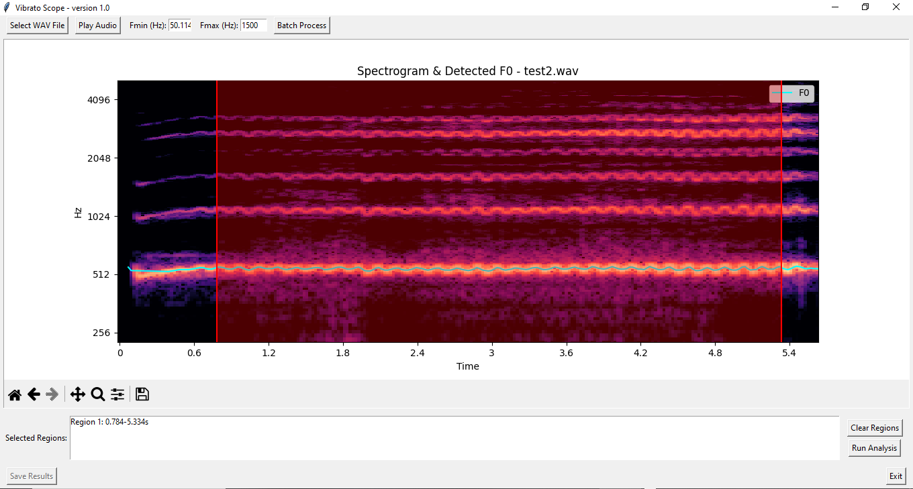
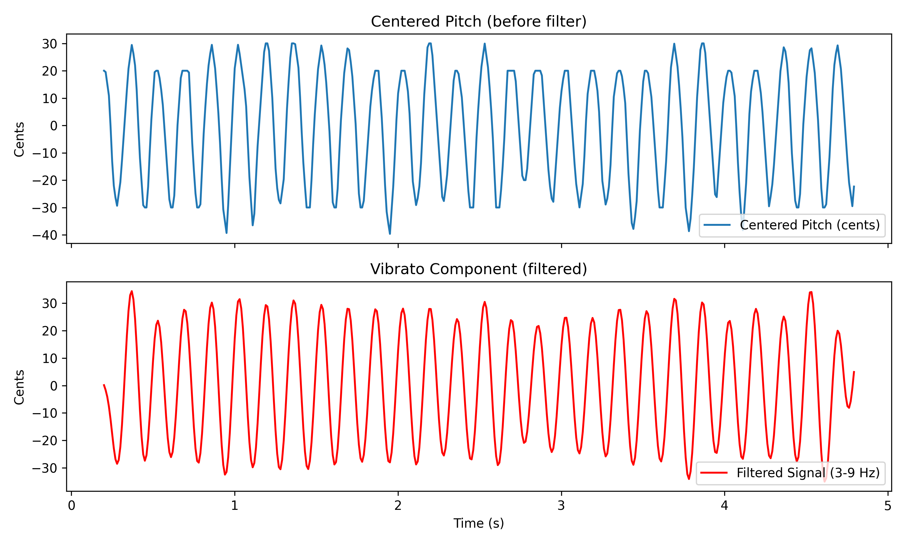
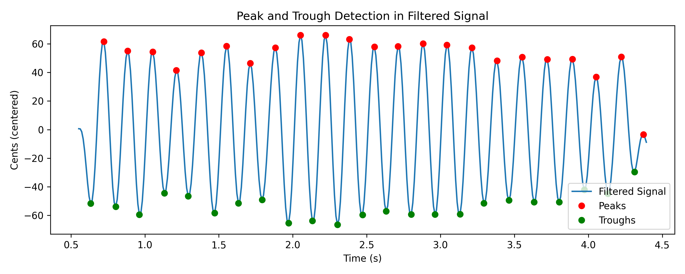
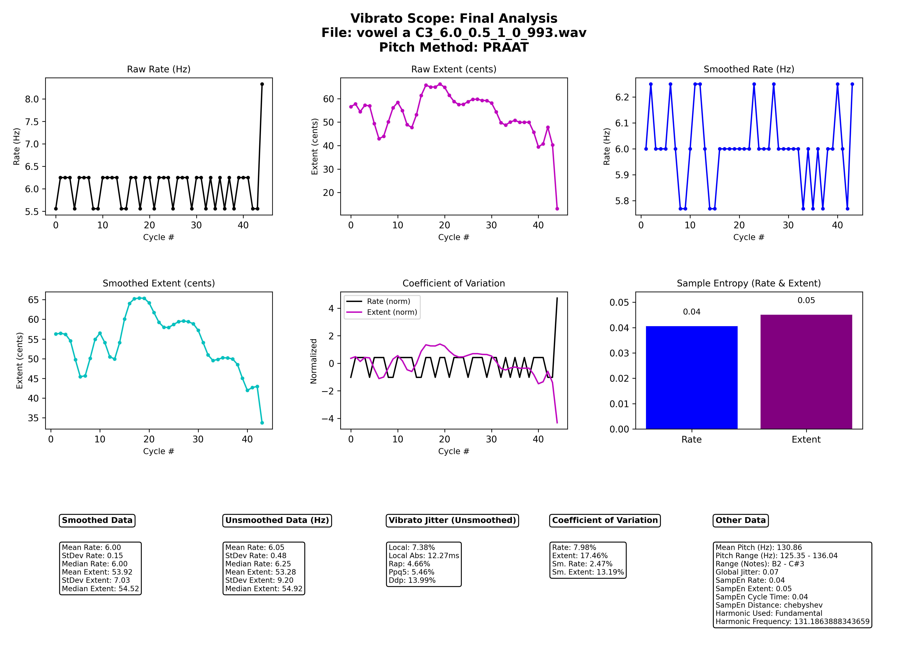

# Summary

Vocal vibrato is a defining feature of trained singing, particularly in Western classical music, where it is described as a periodic fluctuation in the fundamental frequency ($fo$), often accompanied by coordinated variations in loudness and timbre. Foundational definitions [@seashore1932; @sundberg1994] characterize good vibrato as a pulsation that enhances tonal richness and expressiveness.

Its acoustic analysis typically includes parameters such as vibrato rate (Hz), extent (cents or semitones), and regularity. In this context, jitter refers to cycle-to-cycle variation in vibrato period, shimmer refers to cycle-to-cycle variation in vibrato amplitude, and sample entropy is used as a measure of temporal irregularity. More advanced descriptors such as determinism and line length have also been used to quantify vibrato stability and complexity [@manfredi2015; @acosta2023].

[@manfredi2015] proposed a high-resolution method using the BioVoice software, referencing extent norms reported by [@ferrante2011] and [@anand2012]. [@capobianco2023] highlighted stylistic differences, showing that Early Music singing features faster, narrower, and less regular vibrato than Romantic style. Variability across genres and historical contexts has also been observed in jazz [@manfredi2015], operetta and schlager [@nestorova2023], and contemporary commercial music (CCM) [@hakanpaa2021]. Additionally, [@glasner2022] noted that historical recording technology may have influenced vibrato perception and performance in modern opera singers.

# Statement of Need

Vibrato is a cornerstone of vocal expression, yet its quantitative analysis is often constrained by the limitations of existing tools. Proprietary software like VoceVista Pro provides real-time vibrato overlays on spectrograms but is hindered by opaque algorithms, limited export options, and commercial licensing costs, reducing transparency and reproducibility [@vocevista2022]. BioVoice offers high-resolution estimates of vibrato rate, extent, jitter, and shimmer, but its Windows-only executable lacks batch processing and an API, limiting integration with automated pipelines [@morelli2019]. Open-source alternatives, such as the Embodied Music Lab (EML) Vibrato Tools [@howell2025], are cross-platform Praat plugins that provide a user-friendly graphical interface and do not require coding skills or manual scripting. These tools offer default configurations that work for most cases. While the need to install Praat and the plugin may represent an additional step, the EML tools are highly accessible and well-documented. The Vibrato Analysis Toolbox (VAT) provides a sophisticated Hilbert-transform pipeline with user-definable filters, yet its reliance on MATLAB ties it to costly licenses and demands signal-processing expertise, restricting its accessibility [@zhang2017].

VibratoScope was designed to address these gaps by providing a standalone Python-based environment for vibrato analysis with interactive visualization and GUI-based batch processing. Implemented in Python and released under an MIT license, it supports multiple pitch extraction methods, including Praat [@boersma1993], YIN [@decheveigne2002], Harmonic Product Spectrum [@noll1970], REAPER [@talkin2015], and SFEEDS [@kitayama2024], an experimental spectral $fo$ estimation method adapted from a Praat-based workflow. It also provides transparent CSV and PNG outputs that can be used in downstream statistical workflows. In this way, VibratoScope complements existing tools by combining a standalone graphical interface, multiple $fo$ estimators, and exportable outputs for vibrato-focused analysis.

# Installation

To install VibratoScope, ensure Python 3.9 or higher is installed. Then, execute the following commands:

```bash
git clone https://github.com/tiagolbc/vibratoscope.git
cd vibratoscope
pip install -r requirements.txt
python run.py
```

Some features also depend on system-level components, including `tkinter` for the GUI and PortAudio for `pyaudio`.

# Example Use

VibratoScope supports interactive analysis and GUI-based batch processing:

**Interactive Analysis:**

- Launch the GUI by running `python run.py`.
- Load a .wav file and select a region of interest using the GUI's time-domain viewer.
- Click "Run Analysis" to compute vibrato metrics, which are displayed as plots and saved as CSV/PNG files.

**Batch Processing:**

- Select multiple `.wav` files through the GUI batch-processing workflow.
- Run the analysis through the GUI batch-processing workflow, using the selected analysis settings.
- Results are organized in structured folders, with each file generating corresponding CSV and PNG outputs.

These workflows make VibratoScope suitable for both detailed case studies and larger collections of recordings.

# Validation and Testing

VibratoScope includes a set of pre-analyzed audio files and outputs in the `examples/` directory. These synthetic test cases contain singing vowel sounds with known vibrato parameters (e.g., 5.0 Hz rate, 0.3 semitone extent) and are used as controlled reference examples for inspecting software behavior under known conditions.

Each example provides:
- A `.wav` file with controlled vibrato features
- Output figures including pitch traces, cycle-by-cycle plots, entropy, and summary analysis
- Corresponding CSV files with extracted metrics

The example below illustrates the analysis of a synthetic vowel with 5.0 Hz vibrato rate and 0.3 semitone extent.


# Implemented Metrics

VibratoScope models vibrato as a periodic modulation of the fundamental frequency $f_0(t)$. Vibrato extent (in cents) is calculated as:

$$
\text{Extent} = 1200 \cdot \log_2\left(\frac{f_0(t)}{f_{\text{mean}}}\right)
$$

where ( f_0(t) ) is the instantaneous fundamental frequency, and ( f_{\text{mean}} ) is the mean frequency over the analyzed segment. 

Vibrato rate is derived from the duration of consecutive half-cycles detected from peaks and troughs in the bandpass-filtered contour. Jitter is computed from cycle-to-cycle variation in half-cycle duration, and shimmer from cycle-to-cycle variation in oscillation amplitude. Sample entropy ($\text{SampEn}$) is used to describe irregularity in the temporal sequence of vibrato parameters and is defined as

$$
\text{SampEn}(m, r, N) = -\ln\left(\frac{A}{B}\right)
$$

where $m$ is the pattern length, $r$ is the tolerance, $N$ is the number of data points, and $A$ and $B$ are counts of matching patterns in the time series. Determinism and line length, when used, are recurrence-based descriptors of temporal structure.

# Figures









# Acknowledgements

VibratoScope was developed as part of doctoral research at the Federal University of Minas Gerais (UFMG).

# References
