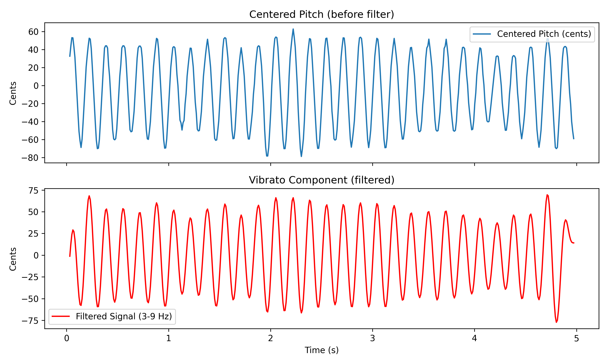

# Summary

Vocal vibrato is a defining feature of trained singing, particularly in Western classical music, where it is described as a periodic fluctuation in the fundamental frequency (f₀), often accompanied by coordinated variations in loudness and timbre. Foundational definitions by Seashore [@seashore:1932] and Sundberg [@sundberg:1994] characterize good vibrato as a pulsation that enhances tonal richness and expressiveness.

Its acoustic analysis typically includes parameters such as vibrato rate (Hz), extent (cents or semitones), and regularity. The latter is often assessed via jitter and shimmer, representing cycle-to-cycle variations in frequency and amplitude, respectively. More advanced descriptors like sample entropy, determinism, and line length have been used to quantify vibrato complexity and stability [@manfredi:2015; @acosta:2023].

Manfredi et al. [@manfredi:2015] proposed a high-resolution method using the BioVoice software, referencing extent norms reported by Ferrante [@ferrante:2011] and Anand et al. [@anand:2012]. Capobianco et al. [@capobianco:2023] highlighted stylistic differences, showing that Early Music singing features faster, narrower, and less regular vibrato compared to Romantic style. Variability across genres and historical contexts has also been observed in jazz [@manfredi:2015], operetta and schlager [@nestorova:2023], and contemporary commercial music (CCM) [@hakanpaa:2021].

Additionally, Glasner and Johnson [@glasner:2022] noted that historical recording technology may have influenced vibrato perception and performance in modern opera singers. These findings reinforce the view of vibrato as a stylistically dependent and context-sensitive vocal parameter.


# Installation

To install VibratoScope, ensure Python 3.9 or higher is installed. Then, execute the following commands:

```bash
git clone https://github.com/tiagolbc/vibratoscope.git
cd vibratoscope
pip install -r requirements.txt
python vibratoscope.py
```

The repository includes a requirements.txt file listing all dependencies, ensuring a straightforward setup across platforms.

# Example Use

VibratoScope supports both interactive and automated workflows:

**Interactive Analysis:**

- Launch the GUI by running `python vibratoscope.py`.
- Load a .wav file and select a region of interest using the GUI's time-domain viewer.
- Click "Run Analysis" to compute vibrato metrics, which are displayed as plots and saved as CSV/PNG files.

**Batch Processing:**

- Select multiple .wav files via the GUI or command-line interface.
- Run the analysis without manual region selection, using default or user-specified parameters.
- Results are organized in structured folders, with each file generating corresponding CSV and PNG outputs.

These workflows make VibratoScope versatile for both detailed case studies and large-scale dataset analysis.

# Validation and Testing

VibratoScope includes a set of pre-analyzed audio files and outputs in the `examples/` directory. These synthetic test cases contain singing vowel sounds with known vibrato parameters (e.g., 5.0 Hz rate, 0.3 semitone extent) and are used to validate the vibrato detection algorithms.

Each example provides:
- A `.wav` file with controlled vibrato features
- Output figures including pitch traces, cycle-by-cycle plots, entropy, and summary analysis
- Corresponding CSV files with extracted metrics

These test cases confirm that VibratoScope reliably measures vibrato parameters across known input conditions, validating its use for both research and pedagogical applications.

Figure \autoref{fig:test_example} illustrates the analysis of a synthetic vowel with 5.0 Hz vibrato rate and 0.3 semitone extent, showing accurate pitch detection, vibrato cycle extraction, and summary visualization.


# Statement of Need

Vibrato is a cornerstone of vocal expression, yet its quantitative analysis is often constrained by the limitations of existing tools. Proprietary software like VoceVista Pro provides real-time vibrato overlays on spectrograms but is hindered by opaque algorithms, limited export options, and commercial licensing costs, reducing transparency and reproducibility [@vocevista:2022]. BioVoice offers high-resolution estimates of vibrato rate, extent, jitter, and shimmer, but its Windows-only executable lacks batch processing and an API, limiting integration with automated pipelines [@morelli:2019]. Open-source alternatives, such as the Embodied Music Lab (EML) Praat script, are cross-platform and freely available but require manual configuration and execution within Praat’s scripting console, posing barriers for users without coding expertise [@howell:2024]. The Vibrato Analysis Toolbox (VAT) provides a sophisticated Hilbert-transform pipeline with user-definable filters, yet its reliance on MATLAB ties it to costly licenses and demands signal-processing expertise, restricting its accessibility [@zhang:2017].

VibratoScope was designed to address these gaps, offering a comprehensive, open-source solution for high-throughput vibrato analysis. Implemented in Python and released under an MIT license, it combines: (i) an intuitive graphical user interface (GUI) for interactive audio selection, pitch extraction, and vibrato cycle detection, accessible to non-programmers; (ii) a command-line interface supporting unattended batch processing with multiple pitch extraction methods, including Praat [@boersma:1993], YIN [@decheveigne:2002], Harmonic Product Spectrum [@noll:1970], and REAPER [@talkin:2015]; and (iii) transparent CSV and PNG outputs that integrate seamlessly with statistical and machine-learning workflows. By merging the ease-of-use of commercial GUI software, the extensibility of script-based tools, and the accessibility of open-source code, VibratoScope enables reproducible research for voice scientists, pedagogues, and clinicians. Its class-based API allows developers to extend functionality, while its platform-independent design supports diverse applications, from vocal pedagogy to cross-cultural studies of singing styles. Adopted in academic settings, including graduate courses and workshops at conferences like the Pan-European Voice Conference, VibratoScope meets the growing demand for open, scalable tools in voice research.

# Mathematics

Vibrato is modeled as a periodic modulation of the fundamental frequency ( f_0(t) ). The vibrato extent (in cents) is calculated as:

$$
\text{Extent} = 1200 \cdot \log_2\left(\frac{f_0(t)}{f_{\text{mean}}}\right)
$$

where ( f_0(t) ) is the instantaneous fundamental frequency, and ( f_{\text{mean}} ) is the mean frequency over the analyzed segment. The vibrato rate is derived from the frequency of this modulation, typically computed via Fourier analysis or autocorrelation.

For example, the sample entropy (( \text{SampEn} )) quantifies the irregularity of vibrato oscillations:

$$
\text{SampEn}(m, r, N) = -\ln\left(\frac{A}{B}\right)
$$

where ( m ) is the pattern length, ( r ) is the tolerance, ( N ) is the number of data points, and ( A ) and ( B ) are counts of matching patterns within the time series. These metrics are implemented in VibratoScope to provide robust descriptors of vibrato behavior.

# Figures

{#fig:gui width=90%}

{#fig:pitch_filtering width=90%}

{#fig:peak_trough_detection width=90%}

{#fig:final_analysis width=90%}

# Citations

Citations are formatted using rMarkdown and linked to entries in paper.bib. For example, NumPy is cited as [@numpy], and vibrato metrics are referenced from [@sundberg:1994]. Multiple citations can be combined, e.g., [@numpy; @scipy].

# Acknowledgements

VibratoScope was developed as part of doctoral research at the Federal University of Minas Gerais (UFMG), with funding from [Funding Agency, if applicable]. I acknowledge contributions from collaborators in voice science and music technology, as well as feedback from reviewers at the Pan-European Voice Conference and The Voice Foundation.

# References
